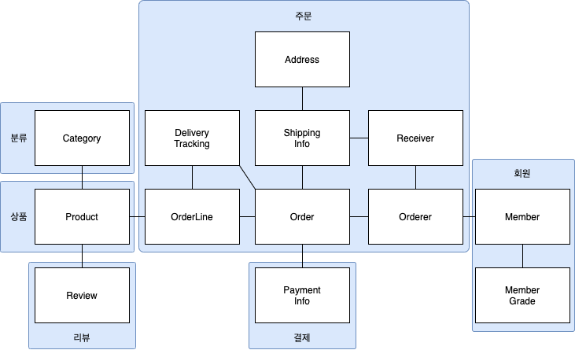

주문 애그리거트는 다음을 포함한다.
- 총 금액인 totalAmounts를 갖고 있는 Order 엔티티 (루트 앤티티)
- 개별 구매 상품의 개수인 quantity와 금액인 price를 갖고 있는 Orderline 밸류

애그리거트에 속한 모든 객체는 정상상태를 가져야한다.
애그리거트의 루트 앤티티는 애그리거트의 대표 엔티티로, 애그리거트 전체를 관리한다.
한 트랜잭션에서는 한 개의 애그리거트만 수정하는 게 좋다.(트랜잭션의 범위는 작을 수록 좋다.)

