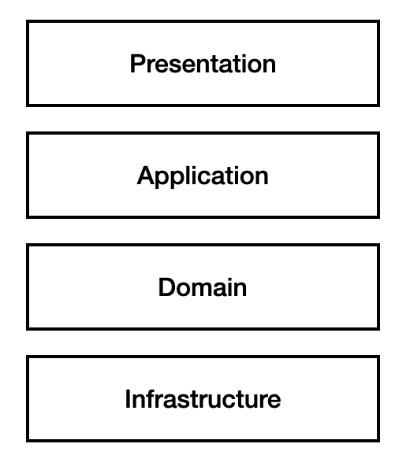

## 5장. 스프링 데이터 JPA를 이용한 조회 기능
목적: DAO와 리포지토리를 활용한 Query 모델 구현
<br>
<br>

## 5.1
### CQRS
- CQRS는 명령(Commend)모델과 조회(Query)모델을 분리하는 패턴이다.
- Commend모델: 상태 변경 기능 e.g., 회원가입, 주문 취소
- Query모델: 데이터 조회 기능 e.g., 주문 목록 보기
<br>

### DAO와 리포지토리

일반적인 웹 어플리케이션의 아키텍처는 위 그림과 같다. 
- DAO(Data Access Object):
  - 데이터 접근을 뜻함.
  - 등장배경: 비즈니스 로직 내에서 직접 데이터베이스에 접근하면 데이터베이스 로직과 비즈니스 로직이 섞여 유지보수 및 확장이 어려움
  - J2EE(스프링 이전 프레임워크)에서 등장한 개념.
  - 인프라 스트럭쳐 계층에 속하므로, DAO를 이용해 바로 entity를 컨트롤하는 것은 잘못됐다.
- 리포지토리:
  - 객체의 상태를 관리하는 저장소.
  - DDD에서 처음 등장한 개념.
  - 리포지토리는 도메인 계층에 속한다.
  - 의존성이 역전(도메인 계층이지만 '리포지토리 인터페이스'라는 추상화된 방식으로 데이터에 접근)되어 있기 때문에, entity를 그대로 가져와 로직을 수행한다. 
    - 도메인 계층: UserRepository 인터페이스 내부에 findAllUsers()라는 메소드가 있다.
    - 인프라 스트럭처 계층: SQLUserRepository 클래스가 UserRepository 인터페이스를 구현하고, SQL 데이터베이스를 사용해 사용자를 찾는 로직을 포함한다.
    - 비즈니스 로직은 데이터가 어디에 있는지, 어떻게 구현되는지 몰라도 된다. findAllUsers() 호출만으로 필요한 작업을 수행할 수 있다. 

<br>
<br>

## 5.2
특정 조건으로 조회할 때 웅리는 find메서드를 활용한다. e.g., findById() <br>
그러나, 검색 조합이 다양해진다면 스펙(Specification)을 사용할 수 있다. <br>
```java
public interface Specification<T>{
    public boolean isSatisfiedBy(T agg);
}
```
실제로, 이화톤에서 개발한 프로젝트에서 스펙을 사용한 적 있다. <br>
```java
// 요구사항: 제목, 카테고리, 기간, 요금, 키워드 중 1개 이상의 input을 클라이언트로부터 받고, 해당 input의 교집합을 검색결과로 보여주자.
public class SearchSpecifications {

    public static Specification<Event> titleContains(String title) {
        return (root, query, criteriaBuilder) -> criteriaBuilder.like(root.get("title"), "%" + title + "%");
    }

    public static Specification<Event> inCategory(Category category) {
        return (root, query, criteriaBuilder) -> criteriaBuilder.equal(root.get("category"), category);
    }

    public static Specification<Event> betweenDates(LocalDate start, LocalDate end) {
        return (root, query, criteriaBuilder) -> criteriaBuilder.between(root.get("start_date"), start, end);
    }

    public static Specification<Event> isFree(Boolean free) {
        return (root, query, criteriaBuilder) -> criteriaBuilder.equal(root.get("free"), free);
    }

    public static Specification<Event>hasKeywords(List<Hashtag> hashtags) {
        return (root, query, cb) -> {
            List<Predicate> predicates = new ArrayList<>();
            for (Hashtag hashtag : hashtags) {
                predicates.add(cb.isMember(hashtag, root.get("suggestedKeywords"))); // Use Enum directly
            }
            return cb.and(predicates.toArray(new Predicate[0]));
        };
    }
}
```

<br>
<br>

## 5.3 ~ 5.4
지금부터 스프링 데이터 JPA를 이용한 스펙 구현에 대해 알아보자. <br> 
[OrdererIdSpec.java](../order/query/dao/OrdererIdSpec.java) <br>
스펙 구현 클래스를 개별적으로 만들지 않고 별도 클래스에 모아놔도 된다. <br>
[OrderSummarySpecs.java](../order/query/dao/OrderSummarySpecs.java) <br>
스펙을 충족하는 엔티티 검색은 findAll()메서드를 활용한다. <br>
[OrderSummaryDao.java](../order/query/dao/OrderSummaryDao.java) <br>

<br>
<br>

## 5.5
스펙을 조합해보자. <br>
- and() : 두 스펙을 모두 충족하는 조건을 표현하는 스펙을 생성
- or() : 두 스펙 중 하나 이상을 충족하는 조건을 표현하는 스펙을 생성
```java
Specification<OrderSummary> spec = OrderSummarySpecs.ordererId("user1")
        .and(OrderSuammrySpecs.orderDateBetween(from, to));
```
- not() : 조건을 반대로 적용
```java
Specification<OrderSummary> spec = Specification.not(OrderSummarySpecs.ordererId("user1"));
```
- where() : <br>
NPE(NullPointerException)가 발생할 가능성이 있는 스펙 객체와 다른 객체를 조합해야 할 경우, NPE 발생 여부 판단해서 방지해야 하는데, 이는 다소 귀찮은 작업이다. <br> 
-> where() 메서드는 정적 메서드로 null을 전달하면 아무 조건도 생성하지 않는 스펙 객체를 리턴하고, null이 아니면 인자로 받은 스펙 객체를 그대로 리턴한다. 
```java
Specification<OrderSummary> spec = Specification.where(CreateNullableSpec()).and(createOtherSpec());
```

<br>
<br>

## 5.6
OrderBy를 사용한 정렬 순서 지정 <br>
[OrderSummaryDao.java](../order/query/dao/OrderSummaryDao.java) <br>
두 개 이상의 속성에 대한 정렬순서 지정도 가능하다. <br>
```java
// OrderDate 속성 기준으로 내림차순 정렬 먼저 하고, Number 기준으로 오름차순 정렬
findByOrdererIdOrderDateDescNumberAsc
```
<br>
그런데 메서드 이름이 너무 길다.. <br>
또한, 메서드 이름으로 정렬ㄹ 순서가 정해지기에 상황에 따라 정렬 순서를 변경할 수가 없다. <br>
이럴 때는 Sort 타입을 사용하면 된다. <br>

[OrderSummaryDao.java](../order/query/dao/OrderSummaryDao.java) <br>

<br>
<br>

## 5.7
페이징 처리는 오픈sw플랫폼 수업 때의 중고마켓플랫폼 개발 시 활용해본 기능이다. <br>
목록을 보여줄 때 전체 목록을 보여주면 uiux적 측면이나 로딩시간 면에서 곤란하므로, <br>
전체 데이터 중 일부만 보여주는 페이징 처리가 필요하다. <br>
<br>
Page가 제공하는 메서드 기능을 아래에 구현해놨다. <br>
[MemberQueryService.java](../member/query/MemberQueryService.java) <br>
[Pagination.java](../common/ui/Pagination.java) <br>
<br>
find 메서드에서 페이징 처리를 하고싶으면 Pageable 타입 파라미터를 넣어주면 된다. <br>
[MemberDataDao.java](../member/query/MemberDataDao.java) <br>

<br>
<br>

## 5.8
스펙을 조합할 때는 조건문을 사용하기도 하나, <br>
코드의 가독성과 구조 단순화를 위해 스펙 빌더를 사용할 수 있다. <br>
[SpecBuilder.java](../common/jpa/SpecBuilder.java) <br>