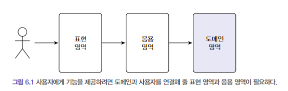

## 6장. 응용 서비스와 표현 영역
<br>

### 6.1
도메인 영역을 잘 구현하는 것은 사용자의 요구를 충족하는, 제대로 된 소프트웨어를 만드는 데에 기본이 된다. <br>
하지만 도메인 영역만 잘 만든다고 끝나는 것은 아니다. <br>
도메인이 제 기능을 하려면 사용자와 도메인을 연결해주는 매개체가 필요한데, 이러한 매개체 역할을 하는 것이 응용 영역과 표현 영역이다. <br>
- 표현 영역(컨트롤러): 사용자의 요청을 해석
- 응용 영역(서비스): 실제 사용자가 원하는 기능을 서비스로써 제공

 <br>
1. 사용자는 웹브라우저에서 폼에 ID, 비밀번호를 입력한 후 submit 버튼을 클릭한다.
2. 표현영역은 URl,요청 파라미터 등을 이용해서 사용자가 실행하고 싶은 기능은 판별하고 해당 서비스를 실행한다. <br>
표현영역에선 응용 서비스의 메서드가 요구하는 파라미터와 표현 영역이 사용자로부터 전달받은 데이터의 형식을 맞춘다. 
3. 사용자가 실행하고 싶은 기능은 응용 영역에 정의되어 있다. <br>
응용 서비스는 기능을 실행하는 데 필요한 입력 값을 메서드 인자로 받고 실행 결과를 리턴한다. <br>

<br>
<br>

### 6.2 응용 서비스의 역할
### 응용 서비스는 단순한 형태를 갖는다. 
응용 영역의 서비스는 주로 도메인 객체 간의 흐름을 제어하는 형태로, 단순한 형태를 갖는다.
```java
public Result doSomeFunc(SomeReq req) {
        // 1. 리포지토리에서 애그리거트 가져오기
        SomeAgg agg = someAggRepository.findById(req.getId());
        checkNull(agg);

        // 2. 애그리거트의 도메인 기능 호출
        agg.doFunc(req.getValue());

        // 3. 결과 리턴
        return createSuccessResult(agg);
        }
```
```java
public Result doSomeCreation(CreateSomeReq req) {
        // 1. 데이터 중복 등 유효성 검사
        validate(req);

        // 2. 애그리거트 생성
        SomeAgg newAgg = createSome(req);

        // 3. 리포지토리에서 애그리거트 저장
        someAggRepository.save(someAgg);

        // 4. 결과 리턴
        return createSuccessResult(newAgg);
        }  
```
<br>

### 응용 서비스는 트랜잭션 처리를 담당한다.
데이터의 일관성을 보장하기 위해 응용 서비스는 트랜잭션 범위에서 실행해야 한다. <br>
<br>

### 응용 서비스는 접근 제어를 담당한다.
<br>

### 응용 서비스는 이벤트 처리를 담당한다.
<br>

### 응용 서비스에는 도메인 로직을 구현하지 않아야 한다. 
도메인 로직은 도메인 영역에 위치하므로, 응용 서비스는 도메인 로직을 구현하지 않아야 한다. <br>
도메인 로직이 도메인 영역과 응용 서비스에 분산되면 다음과 같은 문제가 발생한다.
- 코드의 응집성이 떨어진다.
- 여러 응용 서비스에서 동일한 도메인 로직을 구현할 가능성이 높아진다.

<br>
<br>

### 6.3 응용 서비스 구현 시 주의사항
### 응용 서비스의 크기

응용 서비스는 회원 가입, 탈퇴, 암호 변경 같은 기능을 구현하기 위해 도메인 모델을 사용하게 된다. <br>
이 경우, 응용 서비스는 보통 다음의 두 가지 방법 중 한 가지 방식으로 구현한다. <br>
<br>
- 한 응용 서비스 클래스에 회원 도메인의 모든 구현하기
  - 장점: 관련 기능이 한 클래스에 위치하므로 각 기능에서 동일 로직에 대한 코드 중복을 제거할 수 있다.
  - 단점: 클래스 하나의 크기가 너무 커진다. 
<br>
- 구분되는 기능별로 응용 서비스 클래스를 따로 구현하기
  - 한 응용 서비스 클래스에서 2~3개의 기능을 구현
  - 클래스의 개수는 많아지지만 코드 품질을 일정 수준으로 유지하는 데 도움이 된다.
  - 여러 클래스에 중복 코드가 발생할 가능성이 있으므로, 아래 코드와 같이 별도 클래스에 로직을 구현해 중복을 방지해야 한다.

```java
// 각 응용 서비스에서 공통되는 로직을 별도 클래스로 구현
    public final class MemberServiceHelper {
    public static Member findExistingMember(MemberRepository repo, String memberId) {
    Member member = memberRepository.findById(memberId);
    if (member == null) throw new NoMemberException(memberId);
    return member;
    }
    }

// 공통 로직을 제공하는 메서드를 응용 서비스에서 사용
import static com.myshop.member.application.MemberServiceHelper.*;

public class ChangePasswordService {
private MemberRepository memberRepository;

    public void changePassword(String memberId, String curPw, String newPw) {
    	Member member = findExistingMember(memberRepository, memberId);
        member.changePassword(curPw, newPw);
    }
    ...
}
```
<br>

### 인터페이스와 클래스
응용 서비스 구현 시 인터페이스를 만들고 이를 상속한 클래스를 만드는 것이 필요할까? <br>
```java
public interface ChangePasswordService {
    public void changePassword(string memberId, String curPw, String newPw);
}

public class ChangePasswordServiceImpl implements  changePasswordService{
    
}
```
인터페이스가 필요한 상황은 다음과 같다. <br>
- 구현 클래스가 여러 개일 때
- 런타임에 구현 객체를 교체해야 할 때
-> 그러나 이런 경우는 드물다. <br>
인터페이스가 명확하게 필요하기 전까지는 응용 서비스에 대한 인터페이스 작성이 좋은 선택이라고 볼 수는 없다.

<br>

### 매서드 파라미터와 값 리턴
응용 서비스가 제공하는 메서드는 도메인을 이용해 사용자가 요구하는 기능을 실행하는 데 필요한 값을 파라미터로 전달받아야 한다. <br>
필요한 값을 개별 파라미터로 전달받을 수도, 별도 데이터 클래스를 만들어 전달받을 수도 있다. <br>
스프링 MVC 같은 웹 프레임워크는 웹 요청 파라미터를 자바 객체로 변환하는 기능을 제공하므로 <br>
응용 서비스에 데이터로 전달할 요청 파라미터가 두 개 이상 존재하면 데이터 전달을 위한 별도 클래스를 사용하는 것이 좋다. <br>
(이화톤 개발 시 개별 값으로 전달하느라 줄줄이 코드를 썼던 것이 생각난다...) <br>
<br>
응용 서비스에서 애그리거트 자체(order)를 리턴하는 것은 좋지 않다. 필요한 값(orderNo)을 구체적으로 리턴하자. <br>

<br>

### 표현 영역에 의존하지 않기
응용 서비스에서 표현 영역에 대한 의존이 발생하면.. <br>
- 응용 서비스의 단독 테스트가 어려워진다.
- 표현 영역의 구현이 변경되면 응용 서비스의 구현도 함께 변경해야 한다.
- 응용 서비스가 표현 영역의 역할까지 대신하는 상황이 벌어질 수 있다. 안돼!!!!! 
```java
public class AuthenticationService {
	public void authenticate(HttpServletRequest request) {
    	String id = request.getParameter("id");
        String password = request.getParameter("password");
        if (checkIdPasswordMatching(id, password)) {
        	// 응용 서비스에서 표현 영역의 상태 처리
            HttpSession session = request.getSession();
            session.setAttribute("auth", new Authentication(id)));
        }
    }
}    
```
<br>

### 트랜잭션 처리
회원 가입에 성공했다고 하면서 실제로 회원 정보를 DB에 삽입하지 않으면 고객은 로그인을 할 수 없다. <br>
트랜잭션을 관리하는 것은 응용 서비스의 매우 중요한 역할이다. <br>
스프링 프레임워크가 제공하는 트랜잭션 기능(@Transactional)을 적극 사용하는 것이 좋다. <br>

<br>
<br>

### 6.4


### 6.5
### 6.6
### 6.7